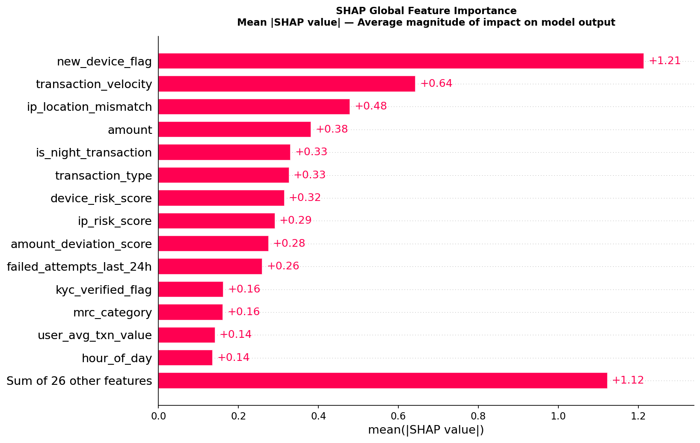
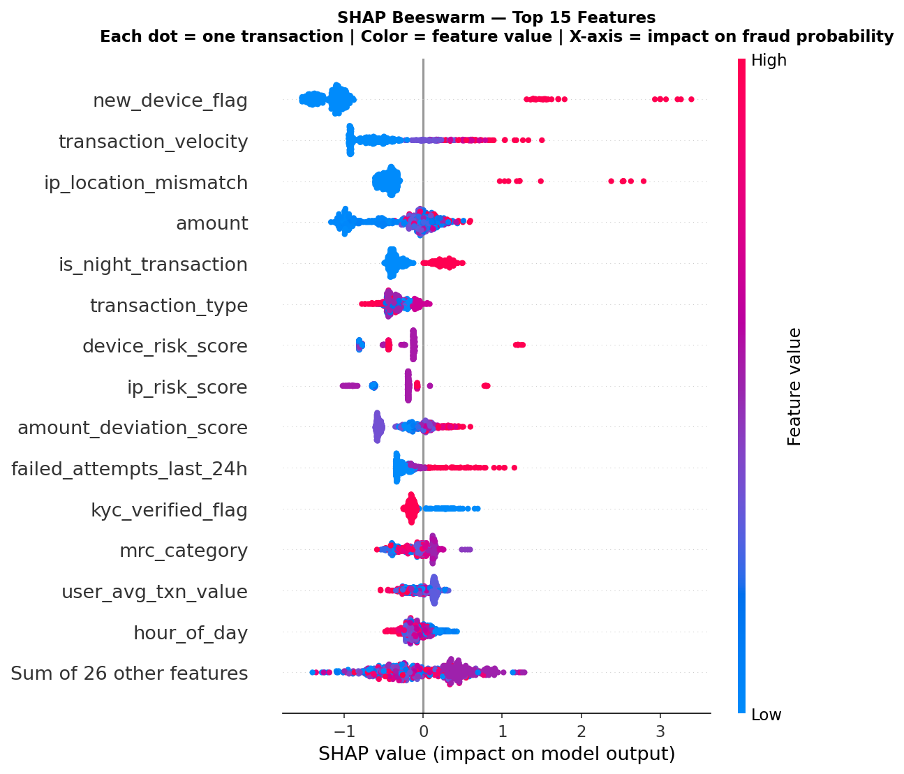
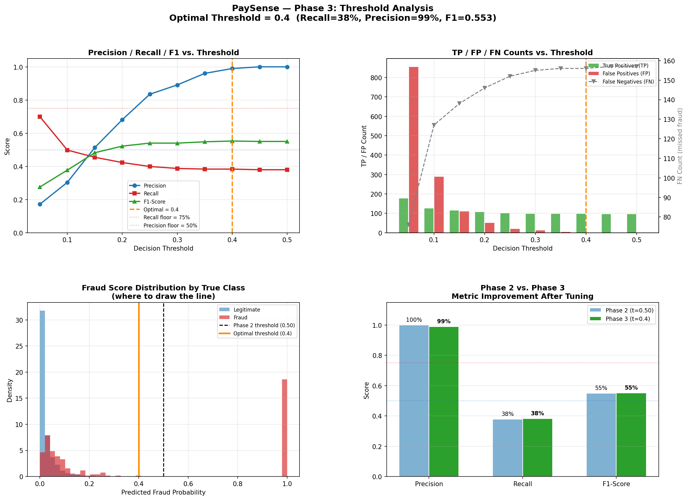

# PaySense — UPI Fraud Detection System

> A three-layer zero-trust fraud detection system for Indian UPI payments, built as an Android application with a FastAPI + XGBoost ML backend. Every incoming bank SMS is parsed, categorised, and scored for fraud risk in real time — personalised to each individual user's spending habits.

**Author:** Nishika Chapra | KJ Somaiya Institute of Technology | 2025

---

## Key Results

| Metric | Value |
|---|---|
| ROC-AUC | **0.8851** |
| PR-AUC *(primary)* | **0.5303** — 12.6× above random baseline |
| Precision @ t=0.50 | **100%** — zero false alerts |
| Recall @ t=0.50 | 37.94% |
| Datasets evaluated | 18 |
| Master dataset | 30,000 rows · 41 features · 4.21% fraud |
| SMOTE applied | Training partition only (24K → 45,980 rows) |

---

## Architecture

```
Bank SMS
    │
    ▼
┌──────────────────────────────────────────────────────────────┐
│  LAYER 1 — SMS Engine  (Android, on-device, no internet)     │
│                                                              │
│  Gate 1: TRAI Sender ID regex  ^[A-Z]{2}-[A-Z0-9]{4,6}$     │
│  Gate 2: Transaction keyword   debited · credited · UPI      │
│  Gate 3: Named-group regex     amount · payee · txnId · date │
└──────────────────────────────┬───────────────────────────────┘
                               │  ParsedTransaction
              ┌────────────────┴────────────────┐
              ▼                                  ▼
┌─────────────────────────┐      ┌───────────────────────────────┐
│  LAYER 2 — Room SQLite  │      │  LAYER 3 — FastAPI + XGBoost  │
│                         │      │                               │
│  Tier 1: Cache lookup   │      │  1. Query 90-day user stats   │
│  Tier 2: NLP classifier │      │  2. Save transaction to DB    │
│  Tier 3: HITL prompt    │      │  3. Compute z-score deviation │
│  (asked once, forever)  │      │  4. POST /predict → XGBoost   │
└─────────────────────────┘      │  5. Update fraud verdict      │
              │                  └───────────────────────────────┘
              └──────────────────────────┐
                                         ▼
                              ┌──────────────────────┐
                              │  Dashboard UI         │
                              │  White card = safe    │
                              │  Red card  = fraud ⚠  │
                              └──────────────────────┘
```

---

## Repository Structure

```
paysense/
│
├── README.md
├── .gitignore                        ← covers Python + Android + IDE
│
├── PaySense-ML-Backend/              ← Python FastAPI server + ML pipeline
│   ├── main.py                       ← FastAPI: /predict, /health endpoints
│   ├── paysense_pipeline.py          ← Phase 1: dataset merge (30K rows)
│   ├── paysense_ml_pipeline.py       ← Phase 2: XGBoost + SMOTE + SHAP
│   ├── paysense_phase3.py            ← Phase 3: threshold tuning + model freeze
│   ├── requirements.txt
│   └── plots/                        ← evaluation charts (committed, no data)
│       ├── paysense_shap_bar.png
│       ├── paysense_shap_beeswarm.png
│       ├── paysense_threshold_analysis.png
│       ├── paysense_evaluation_report.png
│       ├── paysense_class_imbalance.png
│       └── paysense_feature_engineering.png
│
├── PaySense-Android-Client/          ← Kotlin Android app
│   └── app/src/main/
│       ├── AndroidManifest.xml
│       ├── res/layout/
│       │   ├── activity_main.xml
│       │   ├── item_transaction.xml
│       │   └── layout_bottom_sheet_category.xml
│       └── kotlin/com/paysense/app/
│           ├── layer1/SmsReceiver.kt
│           ├── layer2/
│           │   ├── PayeeCache.kt
│           │   ├── PayeeDao.kt
│           │   ├── PayeeCacheRepository.kt
│           │   ├── PaySenseDatabase.kt
│           │   └── TransactionHistory.kt
│           ├── layer3/
│           │   ├── ApiModels.kt
│           │   ├── PaySenseApi.kt
│           │   └── FraudApiService.kt
│           └── ui/
│               ├── MainActivity.kt
│               ├── TransactionAdapter.kt
│               └── CategoryBottomSheet.kt
│
└── PaySense-Report/                  ← IEEE LaTeX report (Overleaf ready)
    ├── paysense_report.tex
    └── [6 PNG figures for LaTeX]
```

---

## SHAP Feature Importance



`new_device_flag` is the dominant fraud signal (mean |SHAP| = 1.17). The personalised `amount_deviation_score` ranks 9th — confirming that raw amount is a weak signal; it only becomes meaningful as a per-user z-score.



---

## Threshold Analysis



Recall ceiling: **67.98%** at threshold=0.05 — a probability calibration issue (not a threshold issue). **Platt Scaling** is proposed as the remediation in future work.

---

## Local Run — Backend

```bash
cd PaySense-ML-Backend

python -m venv venv
source venv/bin/activate       # Windows: venv\Scripts\activate
pip install -r requirements.txt

# Step 1: Build the 30,000-row master dataset (~2 min)
python paysense_pipeline.py

# Step 2: Train XGBoost + generate all SHAP/evaluation plots (~5 min)
python paysense_ml_pipeline.py

# Step 3: Threshold sweep + freeze model to .pkl files
python paysense_phase3.py

# Step 4: Start the API server
uvicorn main:app --host 0.0.0.0 --port 8000 --reload
```

**Verify:**
```bash
curl http://localhost:8000/health
# → {"status":"ok","model_loaded":true,"threshold":0.5,"feature_count":41}
```

**Swagger UI:** [http://localhost:8000/docs](http://localhost:8000/docs)

**Test fraud prediction:**
```bash
curl -X POST http://localhost:8000/predict \
  -H "Content-Type: application/json" \
  -d '{
    "receiver_type":"Merchant","transaction_type":"P2M",
    "payment_app":"GPay","device_type":"iOS",
    "usr_age_group":"35-44","usr_preferred_app":"GPay",
    "usr_preferred_device":"Android","mrc_category":"Grocery",
    "mrc_size":"Medium","amount":15000.00,"hour_of_day":2,
    "day_of_week":0,"is_weekend":0,"is_night_transaction":1,
    "time_since_last_txn_min":3.0,"transaction_velocity":0.95,
    "amount_deviation_score":4.2,"failed_attempts_last_24h":3.0,
    "recurring_payment_flag":0,"transaction_frequency_score":0.88,
    "new_device_flag":1,"ip_location_mismatch":1,
    "user_city_tier":1,"user_avg_monthly_txn":12.0,
    "user_avg_txn_value":200.0,"user_loyalty_score":0.11,
    "balance_after_transaction":980.0,"txn_success_flag":1,
    "kyc_verified_flag":0,"usr_home_city_tier":1,
    "usr_account_age_days":14.0,"usr_linked_bank_count":1.0,
    "usr_avg_monthly_txn_profile":12.0,"usr_avg_txn_value_profile":200.0,
    "usr_is_high_risk":1,"mrc_avg_daily_txn":120.0,
    "mrc_is_registered":1,"mrc_rating":2.1,
    "device_risk_score":0.91,"ip_risk_score":0.87
  }'
# → {"fraud_score":0.98,"is_fraud":true,"alert_level":"high"}
```

---

## Local Run — Android App

### Prerequisites
- Android Studio Hedgehog or newer
- Android SDK API 34
- FastAPI backend running at `http://localhost:8000`

### Setup

1. Open Android Studio → **File → Open** → select `PaySense-Android-Client/`

2. Add to `dependencies {}` in `build.gradle (Module: app)`:
```gradle
implementation("androidx.room:room-runtime:2.6.1")
implementation("androidx.room:room-ktx:2.6.1")
kapt("androidx.room:room-compiler:2.6.1")
implementation("com.squareup.retrofit2:retrofit:2.11.0")
implementation("com.squareup.retrofit2:converter-gson:2.11.0")
implementation("com.squareup.okhttp3:okhttp:4.12.0")
implementation("com.squareup.okhttp3:logging-interceptor:4.12.0")
implementation("org.jetbrains.kotlinx:kotlinx-coroutines-android:1.8.1")
implementation("com.google.code.gson:gson:2.11.0")
implementation("com.google.android.material:material:1.12.0")
```

3. Add to `plugins {}`:
```gradle
id("kotlin-kapt")
```

4. Add to `android {}`:
```gradle
buildFeatures { viewBinding = true }
```

5. In `FraudApiService.kt`, confirm:
```kotlin
private const val BASE_URL = "http://10.0.2.2:8000/"
// 10.0.2.2 = Android emulator's alias for your laptop's localhost
```

6. Click **Run ▶**

### Test SMS via Emulator

In Android Studio emulator → **⋮** → **Phone** → **SMS**

**Safe transaction:**
- Sender: `AD-HDFCBK`
- Message: `Your a/c XX1234 debited Rs.500.00 on 26-Apr-25 to Zomato India UPI Ref: 512345678901. Bal: Rs.12,000.`

Expected Logcat (filter: `PaySense`):
```
PaySense_Layer1: 🟢 GATE 1 PASS | AD-HDFCBK
PaySense_Layer1: 🟢 GATE 2 PASS | 'debited'
PaySense_Layer1: 🔵 GATE 3 EXTRACT | amount=500.0 | payee=Zomato India
PaySense_Layer2: ⚡ Keyword: 'zomato' → Food (0.99)
PaySense_Layer3: ✅ SAFE | score=0.09 | alert=none
```

**Suspicious transaction:**
- Sender: `AD-ICICIB`
- Message: `ALERT: Rs.15000.00 debited to unknown@upi UPI Ref: 987654321098. Time: 02:14 AM.`

Expected:
```
PaySense_Layer3: 🚨 HIGH ALERT | score=0.98 | alert=high
```
UI: Red card with ⚠ icon and "Score: 98%"

---

## Alert Level Logic

| Fraud Score | Alert | Android UI Action |
|---|---|---|
| ≥ 0.70 | `high` | Block payment + push notification |
| 0.40–0.70 | `medium` | Require PIN re-entry |
| 0.20–0.40 | `low` | Silent internal flag |
| < 0.20 | `none` | Log as safe, no user interruption |

---

## Personalised Anomaly Scoring

The core innovation. Instead of flagging a ₹15,000 transaction as suspicious for everyone, PaySense computes how unusual it is **for that specific user**:

```
z_amount = (transaction_amount - user_90day_mean) / user_90day_stddev

Example:
  User always spends ~₹500 (mean=500, std=80)
  New transaction: ₹15,000
  z = (15000 - 500) / 80 = 181.25  ← extreme anomaly

  Same ₹15,000 for a developer who regularly buys cloud servers:
  mean=12000, std=4000
  z = (15000 - 12000) / 4000 = 0.75  ← completely normal
```

**Critical rule:** Statistics are computed **before** saving the current transaction, so the transaction never inflates its own baseline.

---

## Tech Stack

| Layer | Technology |
|---|---|
| Android | Kotlin, Material 3, Room, Retrofit, Coroutines |
| API | FastAPI, Pydantic v2, Uvicorn |
| ML | XGBoost, Scikit-learn, SMOTE, SHAP |
| Data | Pandas, NumPy |

---

## Report

The `PaySense-Report/` folder contains a complete **10-page IEEE-format LaTeX report** ready for Overleaf. Upload `paysense_report.tex` and all 6 PNG files to a new Overleaf project, set compiler to pdfLaTeX, and recompile.

---

## Honest Limitations

- All training data is **synthetic** — real-world performance requires a live shadow-mode trial
- **67.98% recall ceiling** at any threshold — Platt Scaling is proposed as Phase 4 fix
- `new_device_flag` uses a placeholder default in the demo — production needs device fingerprinting APIs

---

*PaySense — Nishika Chapra · KJ Somaiya Institute of Technology · 2025*
