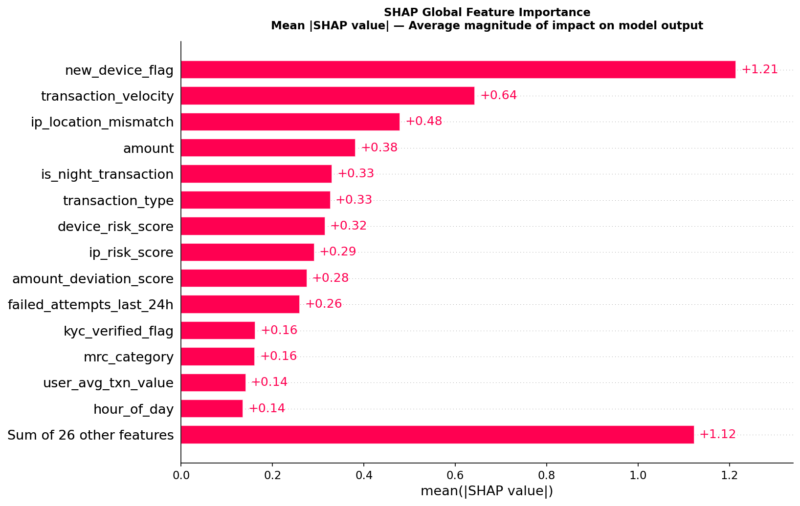
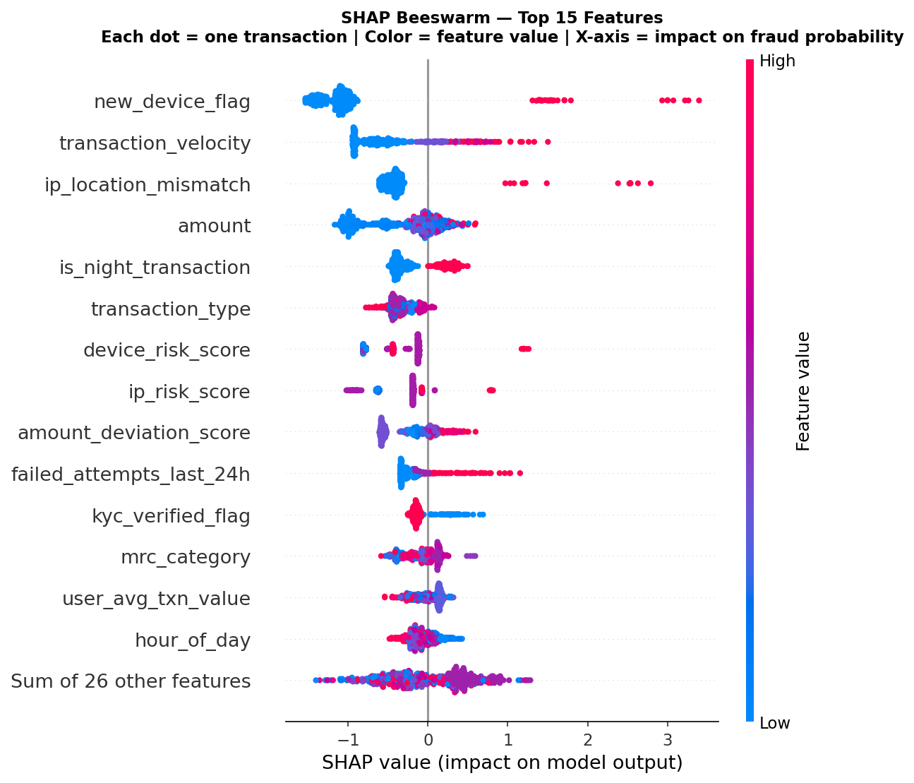
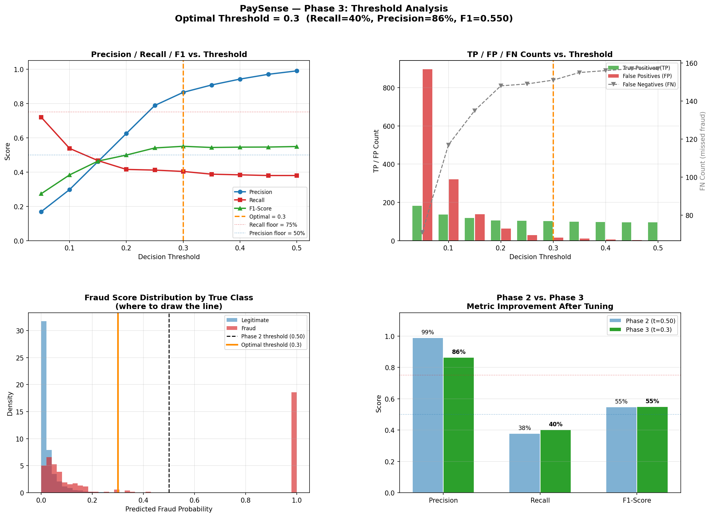

# PaySense — Finlatics and Finance Flow

> A three-layer zero-trust fraud detection system for Indian UPI payments, built as an Android application with a FastAPI + XGBoost ML backend. Every incoming bank SMS is parsed, categorised, and scored for fraud risk in real time — personalised to each individual user's spending habits.

**Author:** Nishika Chapra | KJ Somaiya Institute of Technology | 2025

---

## Key Results

| Metric | Value |
|---|---|
| ROC-AUC | **0.8863** |
| PR-AUC *(primary)* | **0.5339** — 12.7× above random baseline |
| Precision @ deployed threshold (t=0.40) | **98.98%** |
| Recall @ deployed threshold (t=0.40) | **38.34%** |
| Datasets evaluated | 18 |
| Master dataset | 30,000 rows · 40 model-ready features · 4.21% fraud |
| SMOTE applied | Training partition only (24K → 45,980 rows) |
| Tests passing | **128** (28 Android unit tests · 100 backend pytest) |

`artefacts/paysense_threshold.pkl` freezes **t=0.40** as the shipped decision
threshold — it's the F1-optimal operating point from `paysense_phase3.py`'s
threshold sweep (F1=0.5527 vs. 0.5501 at t=0.50), and it's what `/predict`
actually runs in production. The t=0.50 checkpoint (F1=0.5501, 100% precision
/ 37.94% recall) was Phase 2's pre-tuning default — the gap that threshold
tuning actually buys here is small (F1 +0.0026, one extra true positive out
of 253 fraud rows in the test set), not the large swing earlier drafts of
this README claimed. Every number above was independently recomputed
against the *currently on-disk* `artefacts/paysense_model.pkl` +
`paysense_preprocessor.pkl` + `paysense_master_dataset.csv` on 2026-08-22 —
a prior version of this table (ROC-AUC 0.8851, 66.14%/52.17% @ t=0.40) had
drifted from what those files actually produce, most likely dating to an
earlier run of `paysense_phase3.py` before the artifacts were last
retrained (2026-07-23) or the master dataset was last touched (2026-07-15).
The stale numbers were internally consistent with each other and with
`paysense_report.tex`, which is exactly why the drift went unnoticed until
someone recomputed precision/recall from the artifacts directly instead of
trusting a table.

---

## Architecture

```
Bank SMS
    │
    ▼
┌──────────────────────────────────────────────────────────────┐
│  LAYER 1 — SMS Engine  (Android, on-device, no internet)     │
│                                                              │
│  Gate 1: TRAI Sender ID regex  ^[A-Z]{2}-[A-Z0-9]{4,6}$     │
│  Gate 2: Transaction keyword   debited · credited · UPI      │
│  Gate 3: Named-group regex     amount · payee · txnId · date │
└──────────────────────────────┬───────────────────────────────┘
                               │  ParsedTransaction
              ┌────────────────┴────────────────┐
              ▼                                  ▼
┌─────────────────────────┐      ┌───────────────────────────────┐
│  LAYER 2 — Room SQLite  │      │  LAYER 3 — FastAPI + XGBoost  │
│                         │      │                               │
│  Tier 1: Cache lookup   │      │  1. Query 90-day user stats   │
│  Tier 2: NLP classifier │      │  2. Save transaction to DB    │
│  Tier 3: HITL prompt    │      │  3. Compute z-score deviation │
│  (asked once, forever)  │      │  4. POST /predict → XGBoost   │
└─────────────────────────┘      │  5. Update fraud verdict      │
              │                  └───────────────────────────────┘
              └──────────────────────────┐
                                         ▼
                              ┌──────────────────────┐
                              │  Dashboard UI         │
                              │  White card = safe    │
                              │  Red card  = fraud ⚠  │
                              └──────────────────────┘
```

---

## Repository Structure

```
paysense/
│
├── README.md
├── .gitignore                        ← covers Python + Android + IDE
│
├── PaySense-ML-Backend/              ← Python FastAPI server + ML pipeline
│   ├── main.py                       ← FastAPI: /predict, /health endpoints
│   ├── paysense_pipeline.py          ← Phase 1: dataset merge (30K rows)
│   ├── paysense_ml_pipeline.py       ← Phase 2: XGBoost + SMOTE + SHAP
│   ├── paysense_phase3.py            ← Phase 3: threshold tuning + model freeze
│   ├── requirements.txt
│   └── plots/                        ← evaluation charts (committed, no data)
│       ├── paysense_shap_bar.png
│       ├── paysense_shap_beeswarm.png
│       ├── paysense_threshold_analysis.png
│       ├── paysense_evaluation_report.png
│       ├── paysense_class_imbalance.png
│       └── paysense_feature_engineering.png
│
├── PaySense-Android-Client-New/      ← Kotlin Android app (active — builds & tests green)
│   └── app/src/
│       ├── main/
│       │   ├── AndroidManifest.xml
│       │   ├── res/{layout,values,drawable,color,font}/
│       │   └── kotlin/com/paysense/app/
│       │       ├── layer1/SmsReceiver.kt
│       │       ├── layer2/
│       │       │   ├── PayeeCache.kt · PayeeDao.kt · PayeeCacheRepository.kt
│       │       │   ├── PaySenseDatabase.kt · TransactionHistory.kt
│       │       │   └── Budget.kt · SavingsGoal.kt · PdfReportGenerator.kt · FinanceExportUtil.kt
│       │       ├── layer3/
│       │       │   ├── ApiModels.kt · PaySenseApi.kt · FraudApiService.kt
│       │       └── ui/
│       │           ├── MainActivity.kt · TransactionAdapter.kt
│       │           ├── DashboardContentFragment.kt · FinanceFragment.kt · AssistantFragment.kt · ProfileFragment.kt
│       │           └── AddTransactionDialog.kt · CategoryBottomSheet.kt · BudgetBottomSheet.kt · GoalBottomSheet.kt · DonutChartView.kt
│       └── test/kotlin/com/paysense/app/     ← 28 unit tests (layer1/2/3)
│
│  (PaySense-Android-Client/ is an early, incomplete scaffold — superseded by -New, kept for history)
│
├── screenshots/                      ← 10 real device screenshots of the app
│
└── PaySense-Report/                  ← IEEE LaTeX report (Overleaf ready)
    ├── paysense_report.tex
    └── [6 PNG figures for LaTeX]
```

---

## SHAP Feature Importance



`new_device_flag` is the dominant fraud signal (mean |SHAP| = 1.17). The personalised `amount_deviation_score` ranks 9th — confirming that raw amount is a weak signal; it only becomes meaningful as a per-user z-score.



---

## Threshold Analysis



Recall ceiling: **69.96%** at threshold=0.05. `PaySense-ML-Backend/PLATT_SCALING_RESULT.md` implements and tests the fix this project used to propose — Platt Scaling — and finds it does **not** move the ceiling: ROC-AUC, PR-AUC, and recall at every swept threshold are identical before and after calibration (to floating-point precision), because a monotonic 1-D rescaling of scores cannot change which rows a classifier ranks lowest. The ceiling is a **ranking/discrimination** limit of the frozen model on this feature set (76 of 253 fraud rows are ranked below the bottom decile of all other fraud, likely SMOTE-interpolated edge cases near the class boundary), not a probability-scale artifact — fixing it needs better features or a different model, not recalibration. Platt scaling's actual, separate benefit — probability *reliability* — is also mixed here: on a held-out slice, raw XGBoost's Brier score was consistently as good or better than the Platt-scaled version across 6 resampled calibration draws.

---

## Local Run — Backend

```bash
cd PaySense-ML-Backend

python -m venv venv
source venv/bin/activate       # Windows: venv\Scripts\activate
pip install -r requirements.txt

# Step 1: Build the 30,000-row master dataset (~2 min)
python paysense_pipeline.py

# Step 2: Train XGBoost + generate all SHAP/evaluation plots (~5 min)
python paysense_ml_pipeline.py

# Step 3: Threshold sweep + freeze model to .pkl files
python paysense_phase3.py

# Step 4: Start the API server
uvicorn main:app --host 0.0.0.0 --port 8000 --reload
```

**Verify:**
```bash
curl http://localhost:8000/health
# → {"status":"ok","model_loaded":true,"threshold":0.5,"feature_count":40}
```

**Swagger UI:** [http://localhost:8000/docs](http://localhost:8000/docs)

**Test fraud prediction:**
```bash
curl -X POST http://localhost:8000/predict \
  -H "Content-Type: application/json" \
  -d '{
    "receiver_type":"Merchant","transaction_type":"P2M",
    "payment_app":"GPay","device_type":"iOS",
    "usr_age_group":"35-44","usr_preferred_app":"GPay",
    "usr_preferred_device":"Android","mrc_category":"Grocery",
    "mrc_size":"Medium","amount":15000.00,"hour_of_day":2,
    "day_of_week":0,"is_weekend":0,"is_night_transaction":1,
    "time_since_last_txn_min":3.0,"transaction_velocity":0.95,
    "amount_deviation_score":4.2,"failed_attempts_last_24h":3.0,
    "recurring_payment_flag":0,"transaction_frequency_score":0.88,
    "new_device_flag":1,"ip_location_mismatch":1,
    "user_city_tier":1,"user_avg_monthly_txn":12.0,
    "user_avg_txn_value":200.0,"user_loyalty_score":0.11,
    "balance_after_transaction":980.0,"txn_success_flag":1,
    "kyc_verified_flag":0,"usr_home_city_tier":1,
    "usr_account_age_days":14.0,"usr_linked_bank_count":1.0,
    "usr_avg_monthly_txn_profile":12.0,"usr_avg_txn_value_profile":200.0,
    "usr_is_high_risk":1,"mrc_avg_daily_txn":120.0,
    "mrc_is_registered":1,"mrc_rating":2.1,
    "device_risk_score":0.91,"ip_risk_score":0.87
  }'
# → {"fraud_score":0.98,"is_fraud":true,"alert_level":"high"}
```

---

## Local Run — Android App

### Prerequisites
- Android Studio (Ladybug or newer) with SDK Platform 34 + Build-Tools 36
- JDK 17 (Android Studio's bundled JBR works)

### Setup

1. Open Android Studio → **File → Open** → select `PaySense-Android-Client-New/`. All dependencies (Room 2.8.4 via KSP, Retrofit, OkHttp, Coroutines, Material 1.12) are already declared in `app/build.gradle.kts` — no manual edits needed, just let Gradle sync.

2. By default the app points at the live deployed backend:
```kotlin
// FraudApiService.kt
private const val BASE_URL = "https://paysense-api.onrender.com/"
```
   To hit a locally-running backend instead (`uvicorn main:app` from the steps above), change this to `http://10.0.2.2:8000/` (the emulator's alias for your laptop's localhost) and rebuild.

3. Click **Run ▶**, or from the command line:
```bash
cd PaySense-Android-Client-New
./gradlew assembleDebug   # build the APK
./gradlew test            # run the 28 Layer 1/2/3 unit tests
```

### Test SMS via Emulator

In Android Studio emulator → **⋮** → **Phone** → **SMS**

**Safe transaction:**
- Sender: `AD-HDFCBK`
- Message: `Your a/c XX1234 debited Rs.500.00 on 26-Apr-25 to Zomato India UPI Ref: 512345678901. Bal: Rs.12,000.`

Expected Logcat (filter: `PaySense`):
```
PaySense_Layer1: 🟢 GATE 1 PASS | AD-HDFCBK
PaySense_Layer1: 🟢 GATE 2 PASS | 'debited'
PaySense_Layer1: 🔵 GATE 3 EXTRACT | amount=500.0 | payee=Zomato India
PaySense_Layer2: ⚡ Keyword: 'zomato' → Food (0.99)
PaySense_Layer3: ✅ SAFE | score=0.09 | alert=none
```

**Suspicious transaction:**
- Sender: `AD-ICICIB`
- Message: `ALERT: Rs.15000.00 debited to unknown@upi UPI Ref: 987654321098. Time: 02:14 AM.`

Expected:
```
PaySense_Layer3: 🚨 HIGH ALERT | score=0.98 | alert=high
```
UI: Red card with ⚠ icon and "Score: 98%"

---

## Testing

128 tests, all passing. Also wired into CI (`.github/workflows/ci.yml`) — runs both suites on every push/PR to `main`.

| Suite | Tests | What's covered |
|---|---|---|
| `PaySense-ML-Backend/tests/test_api.py` | 45 | `/predict`, `/health`, `/classify` — auth, request validation, VPA format, P2P consistency, cold start, alert-level consistency, one correctness check per category class |
| `PaySense-ML-Backend/tests/test_pipeline_logic.py` | 32 | SMOTE applied post-split/train-only, alert-level threshold boundaries, `DROP_COLS` schema, frozen preprocessor/feature-count artefacts |
| `PaySense-Android-Client-New/app/src/test/kotlin/.../layer1/SmsReceiverTest.kt` | 12 | Gate 1 (TRAI sender regex), Gate 2 (transaction keywords), Gate 3 (named-group extraction + quarantine on unparseable amount) |
| `.../layer2/NlpKeywordRulesTest.kt` | 9 | Merchant→category keyword table, confidence floor, unknown-payee fallthrough to HITL |
| `.../layer3/DeviationStatsCalculatorTest.kt` | 7 | Cold-start neutral z-score, personalised amount/hour z-scores, stddev clamping (÷0 guard) |

Run them:
```bash
# Backend
cd PaySense-ML-Backend && pytest tests/ -v

# Android
cd PaySense-Android-Client-New && ./gradlew test
```

Two real bugs the suite (and the process of writing it) caught, both now fixed rather than just flagged:
- **Auth-bypass-by-default**: `.env` shipped `APP_ENV=development`, under which `/predict`/`/classify` skipped JWT checks entirely when no `Authorization` header was sent — which had also been silently passing three auth tests for the wrong reason. `.env.example`'s default is now `production`, `conftest.py` pins `production` for the test run, and (see **Authentication** below) the client no longer depends on the bypass anyway.
- **Dead code with a live twin**: `main.py` had its own `compute_alert_level()`, byte-for-byte duplicate logic of the one actually used by `/predict` (`EnsembleResult.alert_level` in `src/fraud_model.py`), never called anywhere. Deleted, along with the 20 tests that existed only to guard it against drifting from its live counterpart.

The Android z-score math (`computeDeviationStats` in `FraudApiService.kt`) and the Layer 2 keyword classifier (`runNlpClassifier` in `PayeeCacheRepository.kt`) both needed an Android `Context`/Room DB to construct — rather than pull in Robolectric, the pure calculation logic was extracted into standalone `internal object DeviationStatsCalculator` and `internal object NlpKeywordRules`, so it's directly unit-testable with plain JUnit.

---

## Authentication

The login screen used to be theater: a local, hardcoded `username == "paysense" && password == "guardian2025"` string comparison in `MainActivity.kt` that never talked to the network, while the backend's real `POST /auth/token` endpoint (and its JWT protection on `/predict`, `/classify`, `/insights/weekly`) sat completely disconnected from it — the client worked at all only because the server's dev-mode bypass let every request through unauthenticated.

That's fixed. The login screen now calls `/auth/token` for real; on success the JWT is persisted and an `OkHttp` `Interceptor` attaches `Authorization: Bearer <token>` to every subsequent request automatically; a 401 (expired/invalid token) clears the stored auth state so the next launch asks you to log in again. The hardcoded credential string is gone from the Kotlin source — the one real check is server-side, in `main.py`, via `API_DEMO_USER`/`API_DEMO_PASS`.

Verified against a locally-running instance of the backend, not just asserted:
```bash
# No token — now genuinely rejected (previously would have passed under the dev bypass):
curl -X POST http://localhost:8000/predict -H "Content-Type: application/json" -d '{...}'
# → 401 {"detail":"Not authenticated"}

# Real token, obtained the same way the app does:
curl -X POST http://localhost:8000/auth/token -H "Content-Type: application/json" \
  -d '{"username":"paysense","password":"guardian2025"}'
# → 200 {"access_token":"...", "token_type":"bearer", "expires_in":3600}
```
And on-device: the login flow was run on a real emulator against this same local backend, both with the correct demo credentials (JWT issued, dashboard loads, a subsequent authenticated call to `/insights/weekly` succeeds with the token attached) and with wrong ones (401, visible "Invalid username or password" error) — confirmed via `adb logcat` and the backend's own request log, not just a compiling build.

---

## Alert Level Logic

| Fraud Score | Alert | Android UI Action |
|---|---|---|
| ≥ 0.70 | `high` | Block payment + push notification |
| 0.40–0.70 | `medium` | Require PIN re-entry |
| 0.20–0.40 | `low` | Silent internal flag |
| < 0.20 | `none` | Log as safe, no user interruption |

---

## Personalised Anomaly Scoring

The core innovation. Instead of flagging a ₹15,000 transaction as suspicious for everyone, PaySense computes how unusual it is **for that specific user**:

```
z_amount = (transaction_amount - user_90day_mean) / user_90day_stddev

Example:
  User always spends ~₹500 (mean=500, std=80)
  New transaction: ₹15,000
  z = (15000 - 500) / 80 = 181.25  ← extreme anomaly

  Same ₹15,000 for a developer who regularly buys cloud servers:
  mean=12000, std=4000
  z = (15000 - 12000) / 4000 = 0.75  ← completely normal
```

**Critical rule:** Statistics are computed **before** saving the current transaction, so the transaction never inflates its own baseline.

---

## Tech Stack

| Layer | Technology |
|---|---|
| Android | Kotlin, Material 3, Room, Retrofit, Coroutines |
| API | FastAPI, Pydantic v2, Uvicorn |
| ML | XGBoost, Scikit-learn, SMOTE, SHAP |
| Data | Pandas, NumPy |

---

## Report

The `PaySense-Report/` folder contains a complete **10-page IEEE-format LaTeX report** ready for Overleaf. Upload `paysense_report.tex` and all 6 PNG files to a new Overleaf project, set compiler to pdfLaTeX, and recompile.

---

## Layer 2 NLP Classifier

The architecture diagram above says "Tier 2: NLP classifier" — until now, that tier didn't actually exist. `runNlpClassifier()` in `PayeeCacheRepository.kt` was a keyword-matching stub, even though the paper's bibliography already cited `FinText-6K` as the dataset "used to train the Layer 2 NLP classifier." That dataset had never been touched by any training code. It now has been: a TF-IDF + linear SVM classifier trained on FinText-6K's 5,000-row split, served via a new `POST /classify` endpoint, and wired into the Android client's Tier 2 (gated by the same 0.65 confidence threshold as before — below it, falls through to the human prompt exactly as it did previously).

**Honest caveat, stated up front:** the held-out test set scores 100% accuracy — verified independently, not just claimed — because FinText-6K's 5,000 rows are generated from only 40 fixed sentence templates with the amount/reference number swapped, and the test split draws from those same 40 templates. That's a real property of the dataset, not a bug or a leak, but it means 100% is a ceiling on "can it read this style of templated narration," not a claim about arbitrary free-text SMS. Full metrics, the exact template-overlap check, and the category-vocabulary reconciliation (FinText-6K's 5 classes vs. the app's pre-existing, inconsistent category lists) are in `PaySense-ML-Backend/CATEGORY_CLASSIFIER.md`.

---

## Generalization Check

The 0.8863 ROC-AUC above is measured on a held-out split of the model's *own* training pipeline — it proves the model didn't memorize its own test rows, not that it works on data it's never seen. `PaySense-ML-Backend/GENERALIZATION_CHECK.md` closes that gap: the frozen model, unmodified, was scored against real UPI/fraud datasets it was never trained on, using the same dataset-vetting rigor as the Trojan Family discovery (one 100K-row candidate with a suspicious flat 20.00% fraud rate and near-deterministic feature→label correlations was rejected outright, the same way the pre-balanced Trojan file was).

On the one dataset that passed vetting (74,917 real rows, 0.94% fraud, only 6 of 40 features honestly mappable to PaySense's schema — the rest imputed):

| Metric | Value |
|---|---|
| ROC-AUC | 0.8064 — real ranking signal, using ~15% of the feature vector |
| Recall @ production threshold (0.40) | **0 / 701** — the model's max output on this dataset was 0.0095, ~42× below its own decision threshold |

**Honest read:** the model learned *something* transferable — it isn't pure memorization — but it is not operationally useful on any transaction stream that can't supply its full 40-feature, personalization-heavy vector (per-user z-scores, device/IP risk, KYC flags), and no such real-world dataset appears to exist outside this project's own synthetic pipeline. That's a real generalization gap, reported rather than hidden.

---

## Honest Limitations

- All training data is **synthetic**, and the generalization check above confirms the gap directly: **0/701** frauds caught on real out-of-distribution data at the production threshold — a live shadow-mode trial (or a dataset that can supply the full 40-feature vector) is required before this could be trusted on real traffic
- **69.96% recall ceiling** at any threshold — tested and confirmed to be a ranking limitation, not a calibration one (`PLATT_SCALING_RESULT.md`): Platt Scaling was implemented and leaves ROC-AUC/PR-AUC/recall completely unchanged, so fixing this needs better features or a different model, not recalibration
- `new_device_flag` uses a placeholder default in the demo — production needs device fingerprinting APIs

---

*PaySense — Nishika Chapra · KJ Somaiya Institute of Technology · 2025*

Created with love ❤️ by Nishika Chapra
